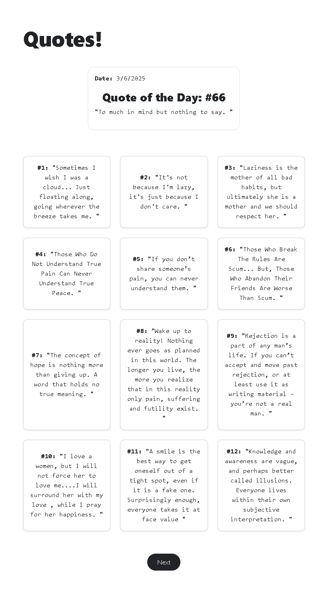
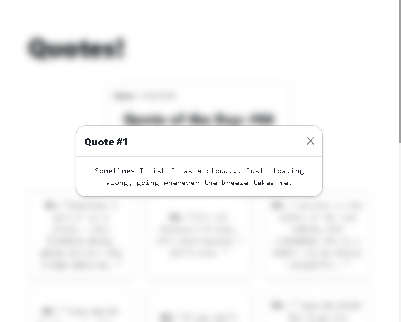

# Quote App

This project is a simple Quote App built with React. It fetches quotes from an external source and displays them in a modern, user-friendly interface.




## Key Features

- **Quote of the Day**: Displays a unique quote for each day.
- **Paginated Quotes**: Browse through quotes with pagination.
- **Responsive Design**: Mobile-friendly and responsive layout.
- **Modal View**: Click on a quote to view it in a modal.
- **Dynamic Title**: Changes the document title based on user activity.

## Technologies Used

- **React**: JavaScript library for building user interfaces.
- **Bootstrap**: CSS framework for responsive design.
- **Fetch API**: For fetching quotes from an external source.
- **JavaScript**: Programming language for logic and interactivity.
- **HTML & CSS**: Markup and styling.

## Setup Guide

Follow these steps to set up the project locally:

### Prerequisites

- **Node.js**: Ensure you have Node.js installed. You can download it from [nodejs.org](https://nodejs.org/).
- **npm**: Node package manager, which comes with Node.js.

### Installation

1. **Clone the repository**:
   ```sh
   git clone https://github.com/SauRavRwT/Quote-App.git
   cd quote-app
   ```

2. **Install dependencies**:
   ```sh
   npm install
   ```

3. **Start the development server**:
   ```sh
   npm start
   ```

   This will run the app in development mode. Open [http://localhost:3000](http://localhost:3000) to view it in your browser. The page will reload when you make changes.

### Available Scripts

In the project directory, you can run:

- **`npm start`**: Runs the app in development mode.
- **`npm test`**: Launches the test runner in interactive watch mode.
- **`npm run build`**: Builds the app for production to the `build` folder.
- **`npm run eject`**: Ejects the configuration files for customization.

## Contributing
We welcome contributions! If you’d like to help improve this project, feel free to fork the repository and submit a Pull Request.
